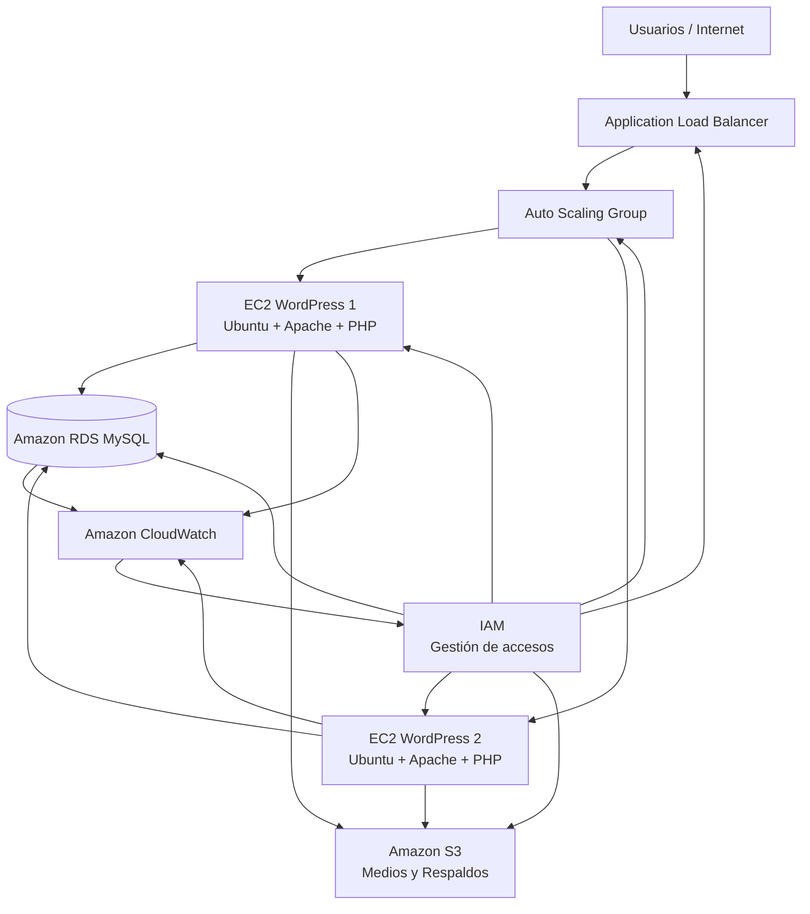

# Proyecto WordPress sobre AWS — Comercial Nova


## Portada del Proyecto

| Campo | Detalle |
|---|---|
| **Proyecto** | Virtualización de Servicios Tecnológicos — Despliegue de sitio WordPress sobre infraestructura AWS |
| **Empresa (caso de estudio)** | Comercial Nova |
| **Curso** | Virtualización de Servicios Tecnológicos |
| **Universidad** | Universidad (Facultad de Ingeniería de Sistemas / Ingeniería Informática) |
| **Ciclo académico** | 2026-I |
| **Docente** | Coordinador de curso |
| **Fecha de entrega** | Julio 2026 |

## Integrantes y Roles

| Integrante | Rol asignado | Responsabilidades |
|---|---|---|
| Integrante 1 | Arquitecto Cloud / Líder de Proyecto | Diseño de arquitectura, VPC, ALB, Auto Scaling |
| Integrante 2 | DevOps Engineer | Automatización, scripts AWS CLI, CloudWatch, IAM |
| Integrante 3 | Administrador de Base de Datos | Configuración de Amazon RDS MySQL, respaldo y seguridad de datos |
| Integrante 4 | Ingeniero de Aplicaciones / WordPress | Instalación y configuración de WordPress, Apache, PHP |
| Integrante 5 | Especialista en Documentación Técnica | Redacción de documentación, evidencias, control de calidad |

> *Nota: los nombres reales de los integrantes deben completarse según la conformación real del grupo de trabajo.*

## Objetivo del Proyecto

Diseñar, implementar y documentar una solución de **alta disponibilidad y escalabilidad** para el despliegue de un sitio web corporativo bajo **WordPress**, utilizando servicios administrados de **Amazon Web Services (AWS)**, aplicando principios de virtualización de infraestructura, seguridad en la nube y buenas prácticas DevOps, para la empresa ficticia **Comercial Nova**, dedicada a la comercialización de productos por canales digitales.

## Problema

Comercial Nova requiere modernizar su presencia web corporativa, migrando desde un modelo de hosting tradicional (servidor físico único, sin redundancia, sin escalabilidad ni monitoreo) hacia una arquitectura en la nube que garantice:

- Disponibilidad continua del sitio web ante fallas de un servidor.
- Capacidad de escalar automáticamente ante picos de tráfico (campañas, temporadas de venta).
- Separación de las capas de aplicación y base de datos para mayor seguridad y mantenibilidad.
- Respaldo confiable de contenido multimedia y archivos estáticos.
- Visibilidad operativa mediante métricas y alertas tempranas.
- Control de acceso granular a los recursos de infraestructura.

El modelo anterior representaba un punto único de falla (SPOF), carecía de mecanismos de monitoreo proactivo y no permitía un crecimiento ordenado de la infraestructura conforme el negocio se expandiera.

## Alcance

El alcance del proyecto comprende:

1. Diseño de una VPC con subredes públicas y privadas distribuidas en múltiples zonas de disponibilidad (AZ).
2. Despliegue de instancias EC2 con Ubuntu Linux, Apache, PHP y WordPress.
3. Implementación de un Application Load Balancer (ALB) para distribución de tráfico.
4. Configuración de un Auto Scaling Group para las instancias de aplicación.
5. Despliegue de Amazon RDS (MySQL) como motor de base de datos administrado.
6. Configuración de Amazon S3 para almacenamiento de medios y respaldos.
7. Implementación de políticas IAM con el principio de mínimo privilegio.
8. Configuración de CloudWatch para monitoreo, métricas y alarmas.
9. Documentación técnica completa del proceso, evidencias, costos y seguridad.

**Fuera del alcance:** implementación de CDN (CloudFront), dominio propio con Route 53, certificados SSL productivos y CI/CD completo (se documentan como mejoras futuras).

## Arquitectura de la Solución



La arquitectura sigue un modelo de **tres capas** (presentación, aplicación y datos) desplegado sobre una VPC segmentada, donde el tráfico de Internet nunca llega directamente a las instancias de aplicación ni a la base de datos, sino que es filtrado y balanceado por el ALB, y las instancias EC2 se ejecutan en subredes con acceso controlado mediante Security Groups.

Ver detalle completo en [`arquitectura/justificacion_arquitectura.md`](arquitectura/justificacion_arquitectura.md).

## Servicios AWS Utilizados

| Servicio | Función en el proyecto |
|---|---|
| **Amazon VPC** | Aislamiento de red y segmentación en subredes públicas/privadas |
| **Amazon EC2** | Servidores de aplicación WordPress (Ubuntu + Apache + PHP) |
| **Amazon RDS (MySQL)** | Base de datos administrada para WordPress |
| **Amazon S3** | Almacenamiento de medios (uploads) y respaldos |
| **AWS IAM** | Gestión de identidades, roles y permisos |
| **Amazon CloudWatch** | Monitoreo, métricas y alarmas |
| **Security Groups** | Firewall a nivel de instancia/servicio |
| **Application Load Balancer (ALB)** | Distribución de tráfico HTTP/HTTPS entre instancias |
| **Auto Scaling Group** | Escalado automático de instancias EC2 según demanda |

### Justificación resumida de cada servicio

- **VPC:** provee aislamiento lógico total de la red de Comercial Nova respecto a otros clientes de AWS, permitiendo control fino sobre el enrutamiento y la exposición a Internet.
- **EC2:** ofrece control total sobre el sistema operativo, necesario para instalar Apache, PHP y WordPress con configuraciones específicas del negocio.
- **RDS MySQL:** elimina la carga operativa de administrar un motor de base de datos (parches, backups, alta disponibilidad), compatible de forma nativa con WordPress.
- **S3:** almacenamiento de objetos duradero (99.999999999% de durabilidad) ideal para medios estáticos y respaldos, desacoplado del ciclo de vida de las instancias EC2.
- **IAM:** permite aplicar el principio de mínimo privilegio, evitando el uso de credenciales root en operaciones diarias.
- **CloudWatch:** provee visibilidad operativa en tiempo real y permite reaccionar proactivamente ante degradaciones de servicio.
- **Security Groups:** actúan como firewall stateful a nivel de instancia, restringiendo el tráfico solo a los puertos y orígenes necesarios.
- **ALB:** distribuye el tráfico entre múltiples instancias, habilitando alta disponibilidad y health checks automáticos.
- **Auto Scaling:** ajusta dinámicamente la capacidad de cómputo según la carga real, optimizando costos y desempeño.

Justificación técnica extendida en [`arquitectura/justificacion_arquitectura.md`](arquitectura/justificacion_arquitectura.md).

## Requisitos

### Requisitos previos

- Cuenta de AWS activa con permisos de administrador (para la fase de configuración inicial).
- AWS CLI instalado y configurado (`aws configure`).
- Par de claves SSH (Key Pair) creado en la región de despliegue.
- Conocimientos básicos de Linux, Apache, PHP y MySQL.
- Cliente SSH (Terminal, PuTTY o similar).

### Requisitos de software (en las instancias EC2)

- Ubuntu Server 22.04 LTS
- Apache2
- PHP 8.1 o superior con extensiones requeridas por WordPress
- Cliente MySQL
- WordPress 6.x

## Cómo Desplegar el Proyecto — Paso a Paso

1. **Crear la VPC y subredes** (2 públicas y 2 privadas, en al menos 2 AZ distintas).
2. **Crear los Security Groups**: uno para el ALB (puertos 80/443 desde Internet), uno para las instancias EC2 (puerto 80 solo desde el ALB, puerto 22 desde IP de administración) y uno para RDS (puerto 3306 solo desde el Security Group de EC2).
3. **Desplegar la instancia RDS MySQL** en subred privada, sin acceso público.
4. **Crear el bucket S3** para medios y respaldos, con versionado habilitado.
5. **Lanzar las instancias EC2** con Ubuntu, instalando Apache, PHP y WordPress (ver [`wordpress/instalacion_configuracion.md`](wordpress/instalacion_configuracion.md)).
6. **Configurar `wp-config.php`** apuntando al endpoint de RDS.
7. **Crear una AMI** a partir de la instancia configurada, para usarla como plantilla del Auto Scaling Group.
8. **Configurar el Launch Template y el Auto Scaling Group**, con políticas de escalado basadas en CPU.
9. **Crear el Application Load Balancer** y su Target Group, asociando el Auto Scaling Group.
10. **Configurar CloudWatch**: métricas y alarmas sobre EC2, RDS y ALB.
11. **Configurar IAM**: roles para EC2 (acceso a S3 y CloudWatch) y usuarios administrativos con políticas de mínimo privilegio.
12. **Validar el despliegue**: acceder al DNS del ALB y completar la instalación de WordPress.

Comandos detallados en [`infraestructura/scripts/comandos_aws_cli.md`](infraestructura/scripts/comandos_aws_cli.md).

## Cómo Acceder a WordPress

1. Obtener el DNS público del Application Load Balancer desde la consola de AWS o mediante:
   ```
   aws elbv2 describe-load-balancers --names alb-comercial-nova
   ```
2. Ingresar la URL en el navegador: `http://<dns-del-alb>`
3. Completar el asistente de instalación de WordPress (idioma, título del sitio, usuario administrador, contraseña, correo).
4. Acceder al panel de administración en `http://<dns-del-alb>/wp-admin`.

Evidencia completa del proceso en [`wordpress/evidencia_publicacion_contenido.md`](wordpress/evidencia_publicacion_contenido.md).

## Evidencias

- Evidencias de instalación y configuración: [`wordpress/instalacion_configuracion.md`](wordpress/instalacion_configuracion.md)
- Evidencias de publicación de contenido: [`wordpress/evidencia_publicacion_contenido.md`](wordpress/evidencia_publicacion_contenido.md)
- Evidencias de servicios AWS (EC2, S3, RDS, CloudWatch, IAM, ALB, Auto Scaling, VPC): [`aws/evidencias_ec2_s3_rds_cloudwatch.md`](aws/evidencias_ec2_s3_rds_cloudwatch.md)
- Pruebas de funcionamiento integrales: [`evidencias/pruebas_funcionamiento.md`](evidencias/pruebas_funcionamiento.md)
- Capturas de servicios: [`evidencias/capturas_servicios/`](evidencias/capturas_servicios/)

## Seguridad

La seguridad se implementó en múltiples capas:

- Segmentación de red mediante VPC (subredes públicas para ALB, privadas para EC2 y RDS).
- Security Groups restrictivos, sin reglas `0.0.0.0/0` en puertos administrativos.
- RDS sin acceso público, solo accesible desde el Security Group de las instancias de aplicación.
- Políticas IAM de mínimo privilegio, sin uso de credenciales root en tareas operativas.
- Cifrado en tránsito recomendado mediante HTTPS (certificado gestionado vía ACM en el ALB).
- Cifrado en reposo habilitado en RDS y en el bucket S3.

Detalle completo en [`seguridad/matriz_accesos.md`](seguridad/matriz_accesos.md).

## Monitoreo

Se configuraron métricas y alarmas en CloudWatch para:

- Utilización de CPU en instancias EC2 (umbral > 80%).
- Estado de salud (Status Checks) de las instancias.
- Utilización de CPU y almacenamiento en RDS.
- Notificaciones automáticas vía Amazon SNS.

Detalle completo en [`monitoreo/alertas_configuradas.md`](monitoreo/alertas_configuradas.md) y dashboard en [`monitoreo/dashboard_metricas.png`](monitoreo/dashboard_metricas.png).

## Costos

Estimación de costos mensuales y anuales de la solución, junto con estrategias de optimización aplicadas.

- [`costos/estimacion_costos.md`](costos/estimacion_costos.md)
- [`costos/optimizacion_costos.md`](costos/optimizacion_costos.md)

## Recursos AWS Utilizados

Inventario completo de los recursos desplegados, con nombre, servicio, estado, región y descripción.

Ver [`aws/inventario_recursos_aws.md`](aws/inventario_recursos_aws.md).

## Limitaciones

- El proyecto no implementa un dominio propio ni certificado SSL productivo (Route 53 + ACM), utilizándose el DNS generado automáticamente por el ALB.
- No se implementó una solución de CDN (CloudFront) para la distribución de contenido estático a nivel global.
- El pipeline de despliegue es semi-manual; no se implementó CI/CD completo (aunque se documenta como mejora futura y se explora Terraform de forma conceptual).
- El entorno fue dimensionado para fines académicos (instancias de bajo costo), no representa el dimensionamiento real de producción de una empresa mediana.
- No se implementó una arquitectura multi-región para tolerancia a desastres (Disaster Recovery).

## Mejoras Futuras

1. Migrar el dominio a Route 53 y habilitar HTTPS con AWS Certificate Manager (ACM).
2. Incorporar Amazon CloudFront como CDN para reducir la latencia global.
3. Automatizar el despliegue completo mediante Terraform o AWS CloudFormation.
4. Implementar un pipeline CI/CD con AWS CodePipeline y CodeDeploy.
5. Configurar Multi-AZ en RDS para alta disponibilidad de base de datos.
6. Implementar AWS WAF para protección adicional contra ataques web (SQLi, XSS).
7. Adoptar Amazon ElastiCache para reducir la carga sobre la base de datos.
8. Configurar backups automáticos cruzados a otra región (Disaster Recovery).

## Conclusiones

El proyecto permitió aplicar de forma práctica los conceptos de virtualización de infraestructura y servicios en la nube, evidenciando cómo una arquitectura basada en servicios administrados de AWS mejora significativamente la disponibilidad, escalabilidad y seguridad de una aplicación web respecto a un esquema tradicional de hosting único. La separación de responsabilidades entre las capas de presentación (ALB), aplicación (EC2 + Auto Scaling) y datos (RDS, S3) demostró ser un patrón robusto, replicable y alineado con las buenas prácticas del [AWS Well-Architected Framework](https://aws.amazon.com/architecture/well-architected/). Asimismo, la incorporación de monitoreo (CloudWatch) y control de accesos (IAM) permitió construir una solución con visibilidad operativa y seguridad desde el diseño (*security by design*).

## Referencias

- Amazon Web Services. *Documentación de Amazon VPC*. https://docs.aws.amazon.com/vpc/
- Amazon Web Services. *Documentación de Amazon EC2*. https://docs.aws.amazon.com/ec2/
- Amazon Web Services. *Documentación de Amazon RDS*. https://docs.aws.amazon.com/rds/
- Amazon Web Services. *Documentación de Amazon S3*. https://docs.aws.amazon.com/s3/
- Amazon Web Services. *Documentación de AWS IAM*. https://docs.aws.amazon.com/iam/
- Amazon Web Services. *Documentación de Amazon CloudWatch*. https://docs.aws.amazon.com/cloudwatch/
- Amazon Web Services. *Elastic Load Balancing – Application Load Balancer*. https://docs.aws.amazon.com/elasticloadbalancing/
- Amazon Web Services. *Amazon EC2 Auto Scaling*. https://docs.aws.amazon.com/autoscaling/
- Amazon Web Services. *AWS Well-Architected Framework*. https://aws.amazon.com/architecture/well-architected/
- WordPress.org. *Documentación oficial de WordPress*. https://wordpress.org/documentation/

---

### Estructura del Repositorio

```
Proyecto-WordPress-AWS/
├── README.md
├── arquitectura/
│   ├── diagrama.drawio
│   └── justificacion_arquitectura.md
├── wordpress/
│   ├── instalacion_configuracion.md
│   └── evidencia_publicacion_contenido.md
├── infraestructura/
│   └── scripts/
│       ├── comandos_aws_cli.md
│       └── terraform_opcional.md
├── seguridad/
│   └── matriz_accesos.md
├── monitoreo/
│   ├── dashboard_metricas.png
│   └── alertas_configuradas.md
├── costos/
│   ├── estimacion_costos.md
│   └── optimizacion_costos.md
├── aws/
│   ├── inventario_recursos_aws.md
│   └── evidencias_ec2_s3_rds_cloudwatch.md
└── evidencias/
    ├── capturas_servicios/
    └── pruebas_funcionamiento.md
```
