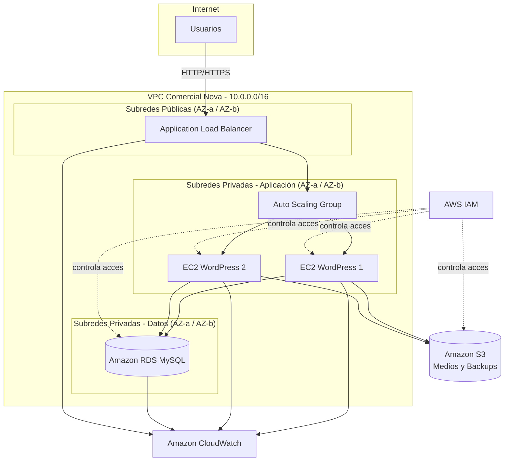

# Justificación de la Arquitectura — Comercial Nova

## 1. Introducción

Este documento sustenta técnicamente las decisiones de arquitectura tomadas para el despliegue del sitio WordPress de **Comercial Nova** sobre AWS. Cada decisión responde a criterios de disponibilidad, escalabilidad, seguridad y costo, siguiendo los pilares del [AWS Well-Architected Framework](https://aws.amazon.com/architecture/well-architected/).

## 2. Diagrama de Arquitectura

## 3. ¿Por qué se eligió AWS?

Amazon Web Services fue seleccionado como proveedor cloud por las siguientes razones técnicas:

- **Madurez y catálogo de servicios administrados**: AWS ofrece servicios PaaS (RDS) e IaaS (EC2) completamente integrados, reduciendo la complejidad operativa frente a un despliegue on-premise.
- **Modelo de responsabilidad compartida**: AWS gestiona la seguridad *de* la nube (infraestructura física, hipervisor), mientras Comercial Nova gestiona la seguridad *en* la nube (configuración de aplicaciones, accesos), lo cual reduce la carga operativa del equipo técnico.
- **Alcance global y disponibilidad de zonas**: la región seleccionada dispone de múltiples zonas de disponibilidad (AZ), permitiendo diseñar una arquitectura tolerante a fallos sin necesidad de infraestructura física redundante propia.
- **Modelo de pago por uso**: no se requiere inversión de capital (CAPEX) inicial en hardware, ajustándose al presupuesto de un proyecto universitario y, por extensión, al de una PYME como Comercial Nova.
- **Documentación y soporte de la comunidad**: AWS cuenta con documentación oficial extensa y un ecosistema de buenas prácticas ampliamente validado (Well-Architected Framework).

## 4. ¿Por qué EC2?

Amazon EC2 fue elegido para alojar WordPress porque:

- WordPress requiere un entorno de ejecución completo (sistema operativo, servidor web, intérprete PHP) que necesita **control total de configuración**, algo que EC2 permite al ofrecer acceso a nivel de sistema operativo (a diferencia de un servicio serverless).
- Permite instalar exactamente las versiones de Apache y PHP requeridas por los plugins y el theme corporativo de Comercial Nova.
- Se integra de forma nativa con Auto Scaling Groups, permitiendo el escalado horizontal de la capa de aplicación.
- Ubuntu Server 22.04 LTS fue seleccionado como sistema operativo por su estabilidad, soporte extendido (LTS) y amplia documentación para pilas LAMP.

## 5. ¿Por qué RDS?

Amazon RDS (MySQL) fue elegido en lugar de instalar MySQL directamente en una instancia EC2 por:

- **Administración automatizada**: RDS gestiona parches de seguridad, backups automáticos y actualizaciones de motor, liberando al equipo de tareas operativas repetitivas.
- **Separación de capas**: al desacoplar la base de datos de las instancias de aplicación, el escalado de EC2 (Auto Scaling) no afecta la integridad ni la disponibilidad de los datos.
- **Snapshots automáticos y point-in-time recovery**: permite restaurar la base de datos ante fallas o errores humanos sin intervención manual compleja.
- **Compatibilidad nativa con WordPress**, que utiliza MySQL/MariaDB como motor estándar.
- **Opción de Multi-AZ** (documentada como mejora futura) para alta disponibilidad de base de datos con failover automático.

## 6. ¿Por qué S3?

Amazon S3 se utilizó para almacenar medios (imágenes, documentos subidos por los editores del sitio) y respaldos porque:

- Ofrece una durabilidad del **99.999999999% (11 nueves)**, muy superior a la de un volumen EBS local.
- Desacopla el almacenamiento de archivos multimedia del ciclo de vida de las instancias EC2: si una instancia se reemplaza (por Auto Scaling), los medios no se pierden.
- Permite versionado de objetos, útil para recuperar versiones anteriores de respaldos.
- Se integra con políticas de ciclo de vida (lifecycle policies) para mover automáticamente respaldos antiguos a clases de almacenamiento más económicas (S3 Standard-IA, Glacier).

## 7. ¿Por qué CloudWatch?

CloudWatch se implementó para dar visibilidad operativa a la solución:

- Permite recolectar métricas de CPU, memoria (mediante agente), estado de instancias, conexiones a RDS y latencia del ALB en un solo panel.
- Habilita **alarmas automáticas** que notifican al equipo técnico ante condiciones anómalas (por ejemplo, CPU > 80%) antes de que el usuario final perciba degradación del servicio.
- Se integra directamente con Auto Scaling, permitiendo que las políticas de escalado se disparen en base a métricas reales de CloudWatch.

## 8. ¿Por qué IAM?

AWS IAM fue implementado para gestionar accesos porque:

- Permite aplicar el **principio de mínimo privilegio**: cada usuario y rol tiene únicamente los permisos estrictamente necesarios para su función.
- Se crearon roles específicos para las instancias EC2 (acceso a S3 y CloudWatch mediante *Instance Profile*), evitando almacenar credenciales estáticas dentro de las instancias.
- Permite auditoría de accesos mediante AWS CloudTrail (complementario), aumentando la trazabilidad de las acciones realizadas sobre la infraestructura.

## 9. ¿Por qué ALB?

El Application Load Balancer fue seleccionado (sobre un Network Load Balancer o un Classic Load Balancer) porque:

- Opera en la **capa 7 (HTTP/HTTPS)**, permitiendo enrutamiento basado en el contenido de la solicitud (host, path), útil si en el futuro se agregan microservicios adicionales.
- Realiza **health checks** activos sobre las instancias registradas, retirando automáticamente del pool a instancias no saludables.
- Soporta de forma nativa la terminación SSL/TLS mediante certificados de AWS Certificate Manager (mejora futura).
- Se integra directamente con Auto Scaling Groups como Target Group.

## 10. ¿Por qué Auto Scaling?

El Auto Scaling Group garantiza que la capacidad de cómputo se ajuste a la demanda real:

- Define una capacidad **mínima, deseada y máxima** de instancias, evitando tanto el sobreaprovisionamiento (costos innecesarios) como el subaprovisionamiento (degradación del servicio).
- Sustituye automáticamente instancias que fallen los health checks del ALB, incrementando la resiliencia sin intervención manual.
- Permite políticas de escalado dinámico basadas en métricas de CloudWatch (por ejemplo, agregar una instancia si la CPU promedio supera el 70% durante 5 minutos).

## 11. Ventajas de la Arquitectura Propuesta

- Alta disponibilidad mediante distribución en múltiples zonas de disponibilidad.
- Escalabilidad horizontal automática ante incrementos de tráfico.
- Separación de responsabilidades entre capas (presentación, aplicación, datos).
- Reducción de la carga operativa gracias a servicios administrados (RDS, ALB, Auto Scaling).
- Seguridad reforzada mediante segmentación de red y políticas IAM.
- Recuperación ante desastres facilitada por snapshots de RDS y versionado en S3.

## 12. Desventajas / Trade-offs

- Mayor complejidad de configuración inicial respecto a un hosting compartido tradicional.
- Curva de aprendizaje para el equipo técnico en servicios administrados de AWS.
- Costo recurrente (OPEX) que debe monitorearse constantemente para evitar sobrecostos.
- Dependencia del proveedor cloud (*vendor lock-in*) en cierto grado, especialmente en servicios administrados como RDS.

## 13. Escalabilidad

La escalabilidad se resuelve en dos dimensiones:

- **Escalabilidad horizontal de la capa de aplicación**: mediante el Auto Scaling Group, que añade o retira instancias EC2 según la demanda.
- **Escalabilidad vertical de la base de datos**: RDS permite cambiar el tipo de instancia (clase `db.*`) sin migrar los datos, ante crecimientos sostenidos de carga.

## 14. Disponibilidad y Alta Disponibilidad

- El uso de al menos **dos zonas de disponibilidad** para las instancias EC2 garantiza que la caída de un centro de datos no interrumpa el servicio.
- El ALB distribuye el tráfico únicamente hacia instancias que superan los health checks, evitando enviar solicitudes a nodos degradados.
- RDS Multi-AZ (mejora futura) proveería failover automático de base de datos en caso de falla de la instancia primaria.

## 15. Seguridad

- Segmentación de red: subredes públicas solo para el ALB; subredes privadas para EC2 y RDS.
- Security Groups como firewall stateful, restringiendo el tráfico al mínimo necesario entre capas.
- RDS sin IP pública, inaccesible desde Internet.
- Cifrado en reposo en RDS y S3; cifrado en tránsito recomendado vía HTTPS en el ALB.

Detalle completo en [`../seguridad/matriz_accesos.md`](../seguridad/matriz_accesos.md).

## 16. Costo

El modelo de pago por uso permite ajustar la capacidad contratada a la demanda real, evitando el sobredimensionamiento típico de infraestructura física. El detalle de la estimación de costos se encuentra en [`../costos/estimacion_costos.md`](../costos/estimacion_costos.md).

## 17. Conclusión

La arquitectura propuesta representa un balance adecuado entre disponibilidad, escalabilidad, seguridad y costo para las necesidades actuales de Comercial Nova, sentando además una base sólida para incorporar mejoras futuras (Multi-AZ, CDN, CI/CD) sin necesidad de rediseñar la solución desde cero.
