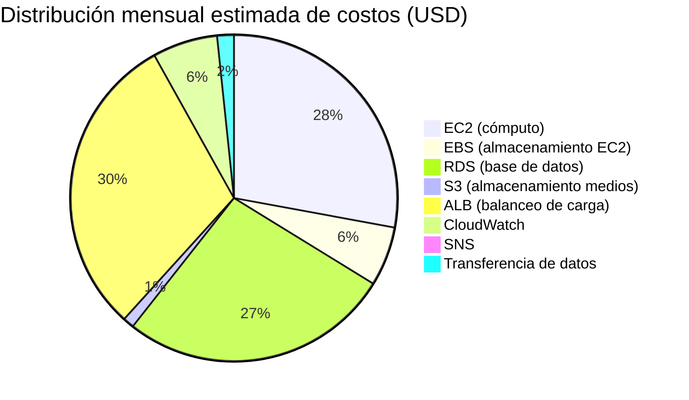

# Estimación de Costos — Proyecto Comercial Nova

## 1. Introducción

Este documento presenta la estimación de costos mensuales y anuales de la infraestructura desplegada para Comercial Nova, calculada con base en la [AWS Pricing Calculator](https://calculator.aws/) y los precios públicos vigentes de la región `us-east-1` (Norte de Virginia) al momento de la elaboración del proyecto. Los valores son referenciales y pueden variar según el uso real y las políticas de precios de AWS.

## 2. Supuestos de Dimensionamiento

- Ambiente de tipo académico/PYME pequeña, no de alta escala productiva.
- 2 instancias EC2 activas en promedio (Auto Scaling entre 2 y 4).
- 1 instancia RDS Single-AZ (sin Multi-AZ en esta fase).
- Tráfico estimado: bajo-moderado (sitio corporativo con blog, sin picos masivos).
- Almacenamiento S3: 20 GB de medios + respaldos periódicos.

## 3. Tabla de Estimación de Costos

| Servicio | Especificación | Costo mensual (USD) | Costo anual (USD) | Justificación |
|---|---|---|---|---|
| Amazon EC2 (x2 `t3.micro`) | 2 instancias, 730 hrs/mes c/u, Linux | $15.18 | $182.16 | Instancias base del Auto Scaling Group en operación normal |
| Amazon EC2 — EBS (gp3, 20 GiB c/u) | 2 volúmenes de 20 GiB | $3.20 | $38.40 | Almacenamiento de sistema operativo y aplicación |
| Amazon RDS MySQL (`db.t3.micro`, Single-AZ) | 20 GiB de almacenamiento gp3 | $14.60 | $175.20 | Base de datos administrada de WordPress |
| Amazon S3 (Standard) | 20 GB almacenamiento + solicitudes | $0.60 | $7.20 | Medios de WordPress y respaldos |
| Application Load Balancer | 1 ALB, uso estándar (LCU) | $16.43 | $197.16 | Distribución de tráfico y health checks |
| Amazon CloudWatch | Métricas personalizadas + alarmas + dashboard | $3.50 | $42.00 | Monitoreo, alarmas y dashboard centralizado |
| Amazon SNS | Notificaciones de alarmas (bajo volumen) | $0.10 | $1.20 | Envío de notificaciones por correo ante alarmas |
| Transferencia de datos saliente | ~10 GB/mes estimados | $0.90 | $10.80 | Tráfico de salida hacia usuarios finales |
| **Total estimado** | | **≈ $54.51** | **≈ $654.12** | |

> **Nota:** los valores del nivel gratuito (Free Tier) de AWS, aplicables durante los primeros 12 meses de una cuenta nueva (750 horas/mes de `t3.micro`, 20 GB de RDS, 5 GB de S3, entre otros), **no se incluyeron** en esta tabla para reflejar un escenario de costos post-Free-Tier, más representativo de la operación real de Comercial Nova a mediano plazo.

## 4. Distribución de Costos por Categoría

## 5. Análisis del Costo

El componente de mayor costo relativo corresponde al **Application Load Balancer** ($16.43/mes), seguido de **EC2** ($15.18/mes) y **RDS** ($14.60/mes). Esto es consistente con el hecho de que el ALB tiene un costo base fijo por hora independientemente del tráfico procesado, más un costo variable por LCU (Load Balancer Capacity Unit).

El costo de **almacenamiento (S3 y EBS)** es marginal en comparación con el cómputo y el balanceo, lo cual valida la decisión de usar S3 para medios sin impacto significativo en el presupuesto.

## 6. Comparación Referencial con Hosting Tradicional

| Modelo | Costo mensual aproximado | Disponibilidad | Escalabilidad |
|---|---|---|---|
| Hosting compartido tradicional | $10 - $30 | Baja (SPOF) | Nula/manual |
| VPS único sin redundancia | $20 - $50 | Media | Manual, requiere downtime |
| **Arquitectura AWS propuesta (este proyecto)** | **≈ $54.51** | **Alta (Multi-AZ para app)** | **Automática (Auto Scaling)** |

Si bien el costo mensual es superior al de un hosting tradicional básico, la arquitectura propuesta ofrece **alta disponibilidad, escalabilidad automática y separación de capas**, características ausentes en los modelos de menor costo, justificando la inversión adicional para una empresa en crecimiento como Comercial Nova.

## 7. Conclusión

La estimación de costos confirma que la solución es **financieramente viable** para una PYME como Comercial Nova, con un costo mensual cercano a los $55 USD, muy por debajo del presupuesto típico de infraestructura de TI de una empresa mediana, y con un retorno claro en términos de disponibilidad, seguridad y capacidad de crecimiento. El detalle de estrategias adicionales para reducir aún más este costo se documenta en [`optimizacion_costos.md`](optimizacion_costos.md).
