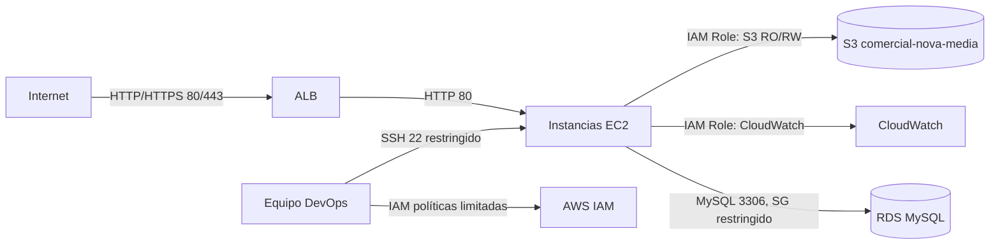

# Matriz de Accesos y Seguridad — Comercial Nova

## 1. Introducción

Este documento define la matriz de accesos aplicada a los recursos de infraestructura y aplicación del proyecto, siguiendo el **principio de mínimo privilegio**: cada usuario, rol o servicio cuenta únicamente con los permisos estrictamente necesarios para cumplir su función.

## 2. Matriz de Accesos

| Recurso | Usuario/Rol | Rol | Permisos | Justificación |
|---|---|---|---|---|
| Cuenta AWS (raíz) | Root Account | Propietario | Todos (uso restringido) | Solo para tareas de facturación y configuración inicial de IAM; no se usa operativamente |
| Consola/CLI AWS | `admin-comercial-nova` | Administrador IAM | `AdministratorAccess` (temporal, fase de diseño) | Configuración inicial de la infraestructura; reemplazado luego por roles granulares |
| Amazon EC2 (instancias WordPress) | `rol-ec2-wordpress-nova` (Instance Profile) | Rol de servicio | `AmazonS3ReadOnlyAccess`, `CloudWatchAgentServerPolicy` | Permite a las instancias leer/escribir medios en S3 y enviar métricas a CloudWatch sin credenciales estáticas |
| Amazon RDS | `admin_nova` (usuario de base de datos) | DBA de aplicación | `ALL PRIVILEGES` sobre la base `wordpress_nova` únicamente | WordPress requiere permisos completos sobre su propia base de datos, pero no sobre otras bases del motor |
| Amazon S3 (`comercial-nova-media`) | `rol-ec2-wordpress-nova` | Lectura/Escritura de objetos | `s3:GetObject`, `s3:PutObject` sobre el bucket específico | Evita acceso a otros buckets de la cuenta AWS |
| Amazon CloudWatch | `rol-ec2-wordpress-nova`, `equipo-devops` | Lectura de métricas / Publicación de métricas | `cloudwatch:PutMetricData`, `cloudwatch:GetMetricData` | Monitoreo operativo sin permisos de modificación de infraestructura |
| AWS IAM (gestión) | `equipo-devops` | Administrador de accesos limitado | `iam:ListRoles`, `iam:GetRole`, sin `iam:CreateUser` en producción | Permite auditar roles sin capacidad de crear nuevas identidades sin aprobación |
| WordPress (aplicación) | `admin_nova` | Administrador del sitio | Control total del sitio (usuarios, plugins, temas, contenido) | Gestión completa de la plataforma de contenido |
| WordPress (aplicación) | `editor_nova` | Editor | Publicar/editar cualquier entrada o página | Gestión de contenido sin acceso a configuración técnica del sitio |
| WordPress (aplicación) | `autor_nova` | Autor | Publicar/editar solo sus propias entradas | Redacción de contenido sin permisos administrativos |
| SSH a instancias EC2 | Equipo DevOps (IP administrativa fija) | Acceso administrativo de sistema | Puerto 22, solo desde IP/bastión autorizado | Evita exposición de administración remota a Internet abierto |
| Application Load Balancer | Público (Internet) | Usuario final | HTTP/HTTPS (puertos 80/443) únicamente | Único punto de entrada público de la arquitectura |

## 3. Diagrama de Flujo de Accesos

## 4. Principios de Seguridad Aplicados

### 4.1 Principio de mínimo privilegio

Ningún componente de la arquitectura posee más permisos de los estrictamente necesarios. Por ejemplo, las instancias EC2 no cuentan con permisos de escritura sobre IAM ni sobre otros servicios ajenos a S3 y CloudWatch.

### 4.2 Segmentación de red

- RDS se ubica en subredes privadas de datos, sin ruta hacia el Internet Gateway.
- Las instancias EC2 se ubican en subredes privadas de aplicación, accesibles únicamente a través del ALB (para tráfico web) o de un bastión/SSM (para administración).
- Solo el ALB reside en subredes públicas.

### 4.3 Ausencia de credenciales estáticas en instancias

Las instancias EC2 no almacenan claves de acceso (`Access Key` / `Secret Key`) para interactuar con S3 o CloudWatch; en su lugar, utilizan un **rol IAM asociado mediante Instance Profile**, cuyas credenciales son temporales y rotadas automáticamente por AWS.

### 4.4 Cifrado

| Dato | Estado |
|---|---|
| RDS — cifrado en reposo | Habilitado (KMS) |
| S3 — cifrado en reposo | Habilitado (SSE-S3) |
| Tráfico ALB — HTTPS | Recomendado mediante ACM (mejora futura) |
| Contraseñas de WordPress | Hasheadas por el propio núcleo de WordPress (bcrypt) |

### 4.5 Reglas de Security Groups (resumen)

| Security Group | Regla | Origen/Destino |
|---|---|---|
| `sg-alb` | Entrada 80, 443 | `0.0.0.0/0` |
| `sg-ec2-wordpress` | Entrada 80 | Solo `sg-alb` |
| `sg-ec2-wordpress` | Entrada 22 | Solo IP administrativa |
| `sg-rds` | Entrada 3306 | Solo `sg-ec2-wordpress` |

> Ninguna regla de administración (SSH, MySQL) se expone a `0.0.0.0/0`, minimizando la superficie de ataque.

## 5. Auditoría y Trazabilidad

Como mejora futura complementaria a esta matriz, se recomienda habilitar **AWS CloudTrail** para registrar de forma inmutable todas las llamadas a la API de AWS realizadas sobre los recursos del proyecto, permitiendo auditorías posteriores ante incidentes de seguridad.

## 6. Conclusión

La matriz de accesos definida garantiza que cada componente de la arquitectura de Comercial Nova opera bajo el principio de mínimo privilegio, reduciendo significativamente la superficie de ataque y alineándose con el pilar de **Seguridad** del AWS Well-Architected Framework.
